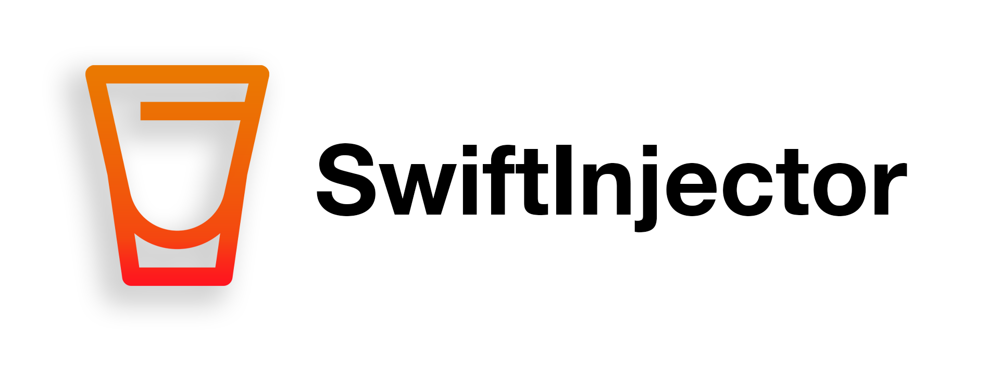
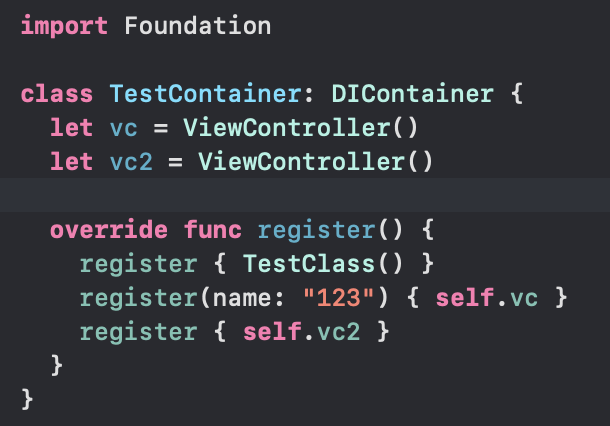
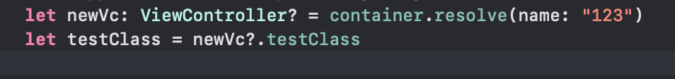
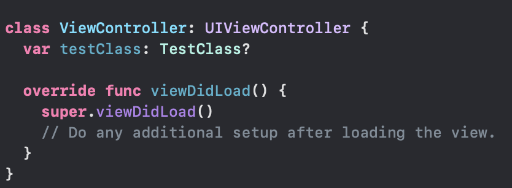

# SwiftInjector

SwiftInjector - library for dependency injection, maden for convinient and fast properties connection

## Things already implemented:
1. Auto registration and autoresolving
Just for example:

2. Works even with private properties!
3. Resolving and registration with 'name' parameter
4. Classes each-to-each references without recursive crash (like in Swinject or DIP libraries)

## Things TO DO for first release
1. Add manual registration and resolving
2. Add certain registration by String Key or specific arguments
3. Perfomance test
4. 70% Code coverage
5. Documentation

## Rules
1. Properties will be automatically injected only on your class, not your parent classes.

